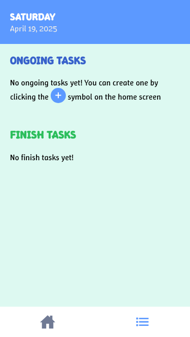

## Development Environment

- Node.js: v18.19.1
- npm: 10.2.4
- Angular CLI: 19.0.0
- Angular: 19.0.0
- Ionic Framework: 8.0.0
- Ionic CLI: 6.20.6
- Capacitor: 7.2.0
- TypeScript: 5.8.3

## How to use
- Download/Clone this repo
- run `npm i` or `npm install`
- run `ionic serve`
- Open your browser to `http://localhost:8100` if it doesn't open automatically

## Screenshots

## Assessment requirements
| Requirements | Files |
| - | - |
| ✅ View a list of tasks (fetched from a public API) | `src/app/components/task-manager/api-tasks` , `src/app/services/task-api.services.ts` |
| ✅ Add a new task (form with title and description) | `src/app/components/task-manager/create-task` , `src/app/services/task-manager.services.ts` |
| ✅ Mark tasks as completed | `src/app/components/task-manager/ongoing-tasks` , `src/app/services/task-manager.services.ts` |
| ✅ Delete a task | `src/app/components/task-manager/ongoing-tasks` , `src/app/services/task-manager.services.ts` |
| ✅ Implement data caching | `src/app/services/task-api.services.ts` |
| ✅ Add basic form validation | `src/app/components/task-manager/create-task` |
| ✅ Apply a CSS library to customize Ionic components | `src/theme` |
| ✅ Ensure a clean, mobile-responsive UI and implement lazy loading | `src/app/app.routes.ts` |
| ✅ Use TypeScript where applicable | |
| ✅ Include component unit testing | All components were created using the Ionic CLI and include unit tests. | 
